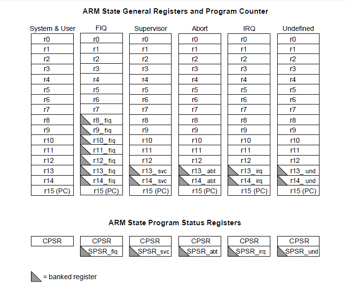

当初学<font color = blue>stm32</font>时因为一个想法，然后就走入了arm汇编的世界，这里就来汇总一下。
<!--more-->

__stm32的arm处理一般有7个运行模式，分别为：__

​	<a>① 用户模式（USR）： 用于正常执行程序（The normal ARM program execution state）</a>

​	<a>② 快速中断模式（FIQ）： 用于高速数据传输（Designed to support a data transfer or channel process）</a>

​	<a>③ 外部中断模式（IRQ）： 用于通常的中断处理（Used for general-purpose interrupt handling）</a>

​	<a>④ 管理模式（SVC）： 操作系统使用的保护模式（Protected mode for the operating system）</a>

​	<a>⑤ 数据访问终止模式（ABT）： 当数据或指令预取终止时进入该模式（Entered after a data or instruction prefetch abort）</a>

​	<a>⑥ 系统模式（SYS）： 运行具有特权的操作系统任务（A privileged user mode for the operating system）</a>>

​	<a>⑦ 未定义指令异常模式（UND）： 当未定义的指令执行时进入该模式（Entered when an undefined instruction is executed）</a>

<>注：ARM微处理器的运行模式可以通过软件改变（<font color=red>修改CPSR后5位</font>），也可以通过中断或者异常处理改变

每个运行模式下访问的寄存器都有一定的区别

在ARM处理器内部共有37个用户可访问的寄存器，分别为

31个通用的32位寄存器和6个状态寄存器




其中的特殊寄存器：
r14：lr寄存器，用来保存pc值
r13：sp寄存器，栈顶寄存器


__常用指令:__

```asm
mov r0,r1   ;r0 = r1
mov r0,#0x1 ;r0 = 0x1
mov r0,r1,lsl #3 ;r0 = r1<<3 逻辑左移(asl算数左移)
mov r0,r1,lsr #3 ;r0 = r1>>3 逻辑右移,高位补0 (asr算数右移，高位补符号位)
ldr r0,[r1] ;将r1对应的指针指向的值存入r0
str r0,[r1] ;将r0存入r1对应的指针指向的地址
;比较指令
cmp r0,r1 ;将r0与r1的值相减，并根据结果设置cpsr的标志位
cmp r0,#100；将r0与100相减，并根据结果设置cpsr的标志位
tst r0,r1 ;把r0的内容和r1的内容或立即数进行按位的与运算，并根据运算结果更新CPSR中条件标志位的值。
;运算指令
add  r0,r1,r2      ;R0 = R1 + R2
add  r0,r1,#256        ;R0 = R1 + 256
add  r0,r2,r3,lsl#1    ;R0 = R2 + (R3 << 1)
orr  r0,r1,r2 ;将r1与r2或立即数做或按位运算并放入r0
;跳转指令
b label ;直接跳转到label处
bl label ;直接跳转到label处，并将当前的pc值存入r14
;伪指令
push {r0} ;压栈入栈,注意stm32压栈为向下压栈,即sp=sp-4
pop {r0}
```

<font color = red>PS:</font> “#0x1”是立即数，立即数是指，能够用0-255之内的数据循环右移偶数位得到的数

判断规则如下：

1. 把数据转换成二进制形式，从低位到高位写成4位1组的形式，最高位一组不够4位的，在最高位前面补0。
2. 数1的个数，如果大于8个肯定不是立即数，如果小于等于8进行下面步骤。
3. 如果数据中间有连续的大于等于24个0,循环左移2的倍数，使高位全为0。
4. 找到最高位的1，去掉前面最大偶数个0。
5. 找到最低位的1，去掉后面最大偶数个0。
6. 数剩下的位数，如果小于等于8位，那么这个数就是立即数，反之就不是立即数。


__函数调用规则:__
1. 函数调用时会执行“BL func”指令
2. 函数参数传递通过r0~r4寄存器，多余参数通过栈传递
3. 进入函数后会执行一条“push {lr}”指令(根据不同情况，会压入其它寄存器)
4. 退出函数时通过r0返回结果，并执行“pop {pc}”(根据不同情况，会弹出其它值到另外的寄存器)


