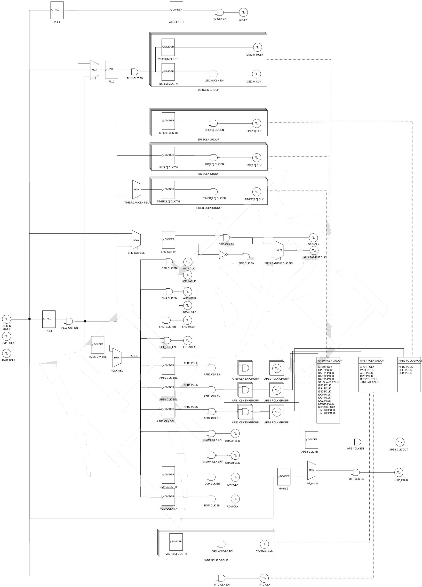
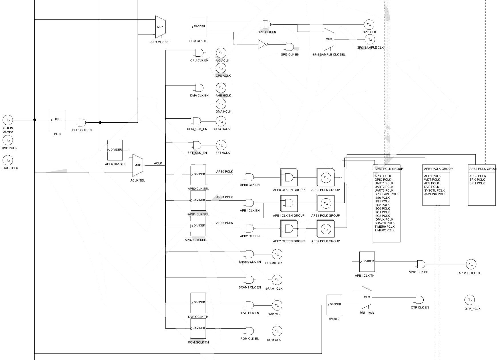
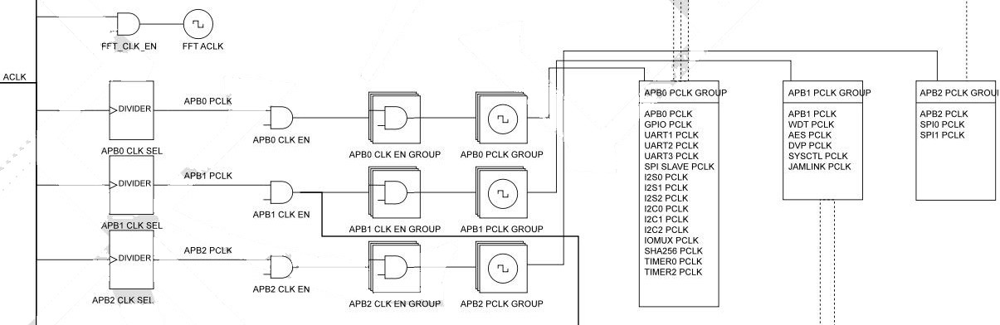
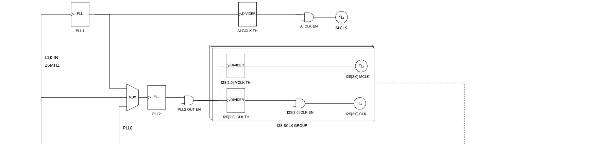
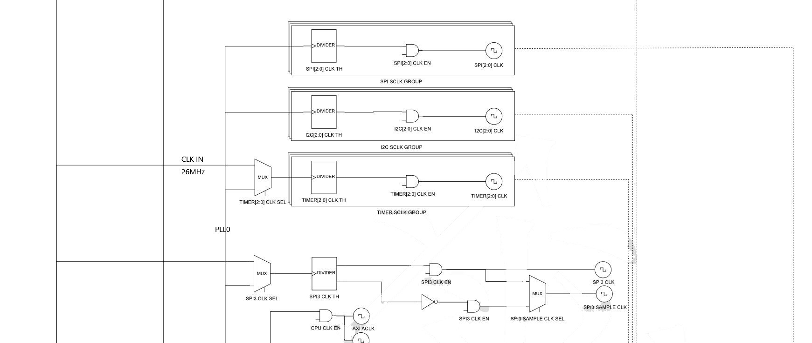

k210时钟树讲解      

<!--more-->

首先来看看完整的k210时钟树

    

看着很复杂对吧，我们来一步一步分析看看  

k210 总共有3个PLL倍频器 

PLL0为内核和大部分外设提供时钟  

PLL1为AI提供时钟

PLL2为I2S提供时钟   

每个PLL内部分别经过：

CLKR（1\~16）分频，CLKF（1\~64）倍频，CLKOD（1\~16）分频   

输出时钟

----
先来看看PLL0    
   

PLL0是最复杂的一部分    

首先，外部26M晶振连入PLL0和ACLK MUX时钟选择器    

PLL0由”PLL0 OUT EN“信号使能输出 

PLL0时钟连入ACLK分频器，ACLK（2,4,8,16）分频器连入ACLK MUX时钟选择   

通过控制”ACLK SEL“信号可选择ALCK时钟是PLL0输入还是26M晶振输入   

ACLK时钟才是实际上为内核和大部分外设提供的时钟  

由图可以看到

ACLK时钟直接给CPU，DMA，SPI3，FFT,SRAM0,SRAM1提供时钟   

ACLK下挂载着APB0~APB2和DVP，ROM这5个分频器  

APB分频器可以提供1~8的分频

每个分频器都有一个与之对应的使能信号    

----

再来看看外设的一部分    

   

每个APB总线可单独堆ACLK分频，分频系数为1\~8

每个APB总线都有个“CLK EN GROUP” 时钟使能组  

意思是每个APB总线上挂载的外设都有个与之对应的时钟使能信号   

APB0上是常用的GPIO，UART，SPI等外设时钟 

这里要注意一下，看到APB外设组旁边的几根虚线没？ 

这个连接的是一些特殊外设，包括TIMER，I2C，SPI，I2S，WDT，  

它们的时钟实际上由专用的分频器提供  

这意味这这几个外设可以更加灵活的在不同频率下工作而不会收到APB时钟影响  

初此之外，APB1时钟还连接着OPT MUX时钟选择器 

OPT MUX时钟选择器还可以选择由外部晶振经过2分频后的时钟

APB1同时通过一个分频器组“APB1 CLK TH”输出APB1时钟

----

下面来看看这些特殊外设  

这里每个分频器都是分频器组

都可以单独为这些外设SPI0，SPI1...TIMER0，TIMER1...   

提供2\~512的分频 

其中还有个更特殊的外设SPI3  

它有独立的时钟选择器，时钟非输出，2路SPI时钟输出    

最下面还有RTC时钟，直接由外部晶振提供

最上面就则是PLL1和PLL2  

PLL1经过“AI GCLK TH”分频器给AI提供时钟  

PLL2输入为MUX时钟选择器，可以由PLL1，PLL0和外部晶振提供输入 

PLL2提供I2S高精度时钟

---

因此，在实际裸机开发时要注意时钟的管理  

可能会由于调整cpu频率而导致其它外设无法工作的情况   

例如在PLL0频率达到600MHz的情况下使用SPI0设备    

如果不对SPI0分频器进行分频，就有会导致SPI0时钟过大  

k210时钟由“sysctl”寄存器组进行控制  

时钟主要由这几个寄存器控制  

PLL0，PLL1，PLL12 控制寄存器    

时钟选择0、1寄存器  

时钟频率设置0~6寄存器   

由于寄存器设置位太多，这里不详细介绍    

详细可参考k210寄存器手册    

