 <b>想必用过keil的都会被keil糟糕的编辑体验和闪瞎眼的界面折磨过      
使用vscode开发环境又难配置  
那么这里就来安利一款十分好用，功能强大的插件--EIDE  
 </b>

<!--more-->

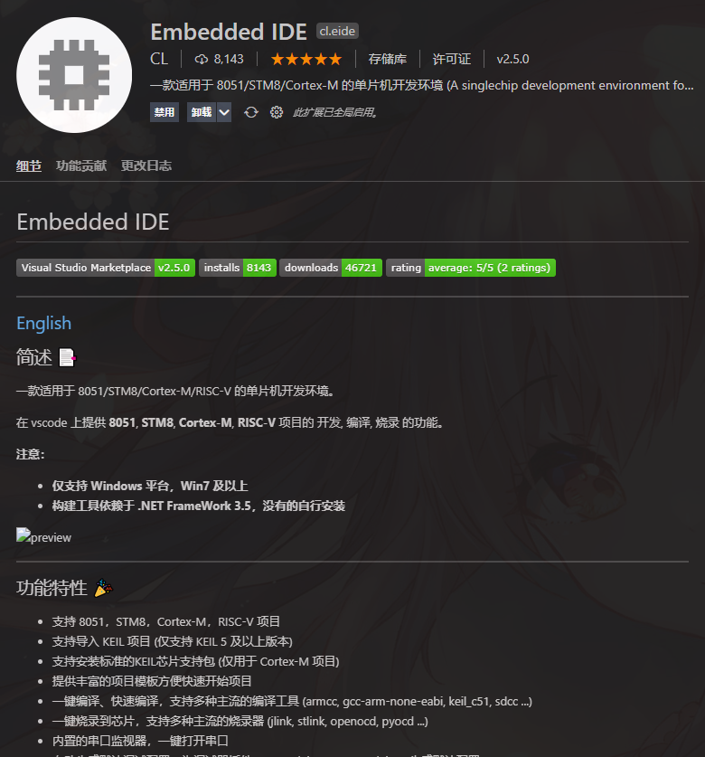   

<b>

首先，你得要有vscode，vscode可以去微软官网下载<kbd>[点击这里](https://code.visualstudio.com/)</kbd>

然后在插件搜索框内搜索”EIDE”和“C++”

c++插件不需多说 
提供了c/c++的自动补全，跳转，自动格式化等强大功能

重点在于EIDE插件
  

装好后它可能会提示你需要.net框架，安装即可，安装完成后重启一次电脑重新打开vscode即可    

点击侧边栏的EIDE插件    

 

你需要指定编译器才能实现对项目的编译    
如果你没有选择任何工具链，那么“设置工具链路径”的图标是一个红色叉叉  
点击设置工具链路径  
它会要求你选择如下编译器    
根据自己的实际情况来选择编译器路径  
如果你使用keil开发51    
那么可以选择 keil c51工具链路径 

 

点击 “keil c51” 
选择你安装keilc51路径下的TOOLS.INI文件

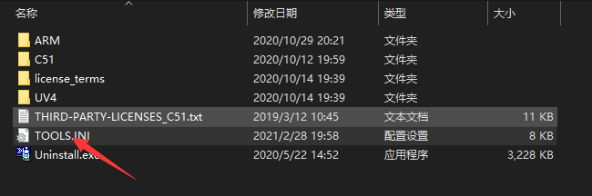   

如果你正确安装了keilc51并且vscode没有配置错的话 
那么“设置工具链路径”的图标就会变成和我一样的黄色感叹号  

接下来创建新项目
点击新建项目    
你可以选择项目的创建方式    
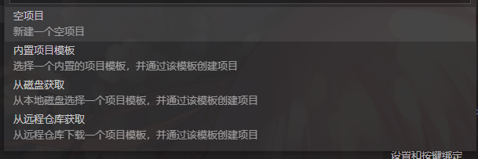   

内置模板项目比较少，但是常用    
也可以从远程仓库选择你想要的模板    
或者自己创建空项目，自己配置    

生成好项目后
就如图所示
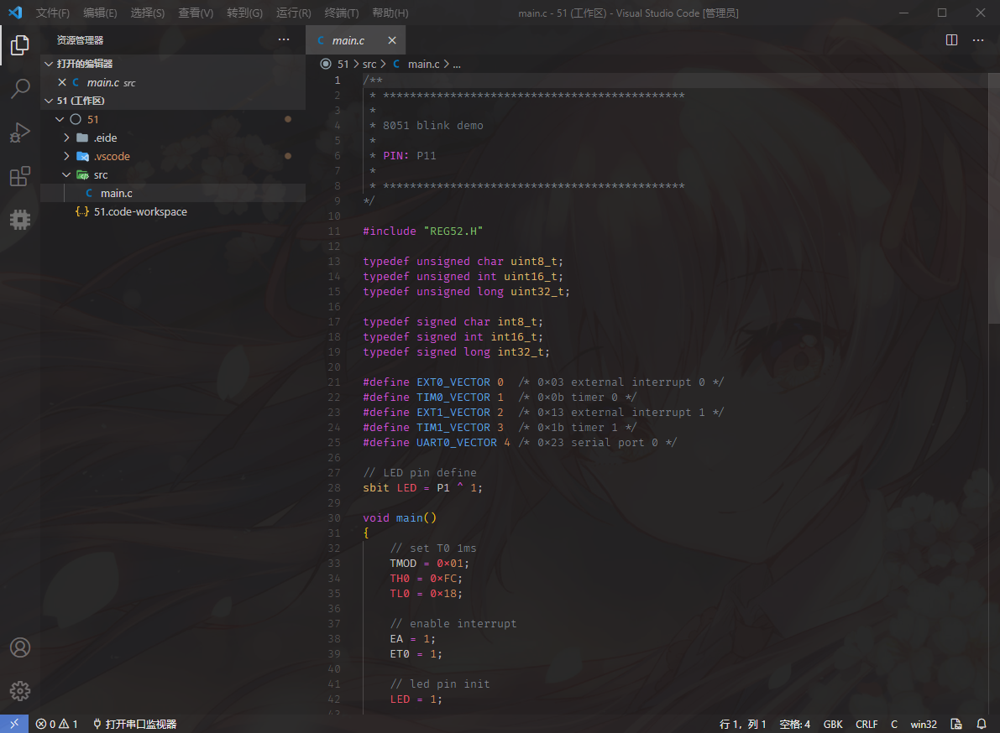   

右边是你的工作区    
src文件夹就是存放你的代码的区域 
.vscode和.eide文件夹是项目配置文件夹，不可修改  

按F7即可开始编译    

点击侧边栏的EIDE插件图标    
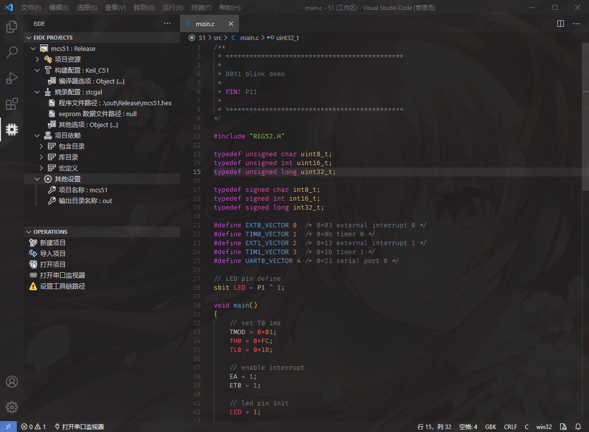   

即可看你项目的详细信息  

你可以配置项目的编译条件和烧录器    

同样可以设置51的编译优化等级    

几乎和keil一模一样  

但是vscode拥有更高的性能和更舒适的开发体验  

----

另外介绍一下如何使用EIDE开发K210    

首先你需要下载官方riscv编译器
并在EIDE里添加你的riscv编译器路径

由于k210的riscv编译器是经过调整的，因此需要额外对EIDE插件的一些设置进行修改

打开EIDE插件设置，找到“EIDE.RISCV: Tool Prefix”选项 

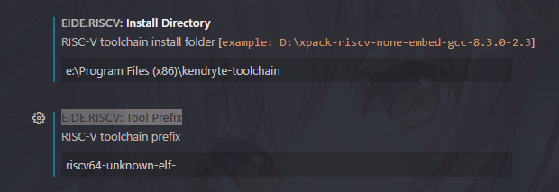
将编译器前缀修改为“riscv64-unknown-elf-”    

这是k210 riscv编译器的前缀名称

在编译器目录下可看到，注意完整的编译器前缀还要加一横

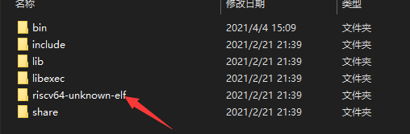  

然后在EIDE中新建项目    

选择“从远程仓库拉取”    

找到k210模板，选择即可  
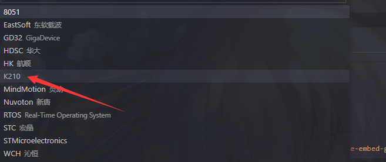 

新建项目完成后如图所示  

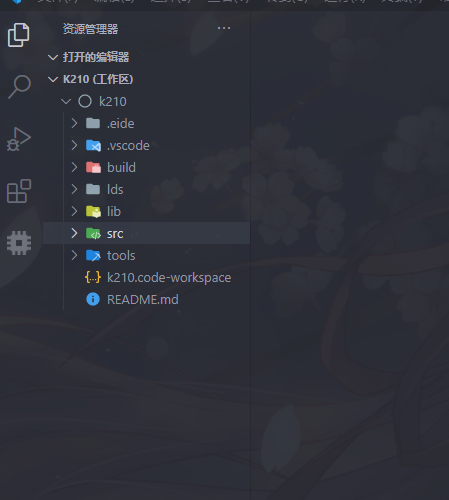  

这里需要添加虚拟文件夹，将src文件里面的所有文件包含进去 

否则添加新文件时，无法正常编译  

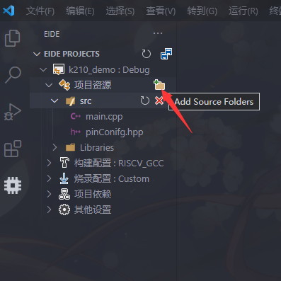      

至此，EIDE插件的k210开发环境配置完成    
用户想要添加什么文件就向src文件夹里添加

除此之外    
EIDE插件还支持arm，架构处理器   
更多功能正在开发    

就我个人来说    
开发51,stm32，k210等主流芯片完全没有问题   
你可以自定义主图，自定义背景
享受更好的开发环境
拥有更高的开发速度和开发质量

改插件由国内大神开发，并拥有独立的论坛和qq群可供玩耍    
另外还有详细的插件文档  
<kbd>[点击这里](https://docs.em-ide.com/#/)</kbd>
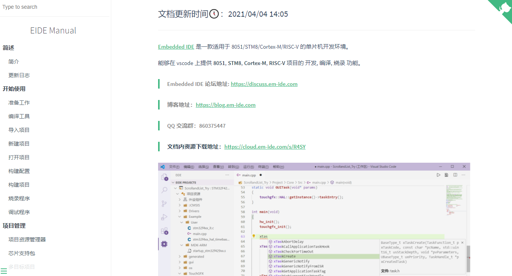

