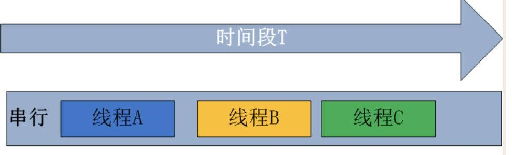

论多线程是如何实现的    
基于arm内核

<!--more-->

在裸机系统中    
有一个主线程和多个子线程
一个线程执行一个函数
每个线程都有自己独自的栈区与代码区

当使用单核cpu时 
为了保证每个线程都能执行    
因此cpu采用一种特殊的机制来切换线程 
即分配给每个线程一个时间片  
该线程的运行时间结束后，即切换栈区和代码区进行线程切换
此时为串行线程  
   
这里使用汇编来实现简单的线程切换    


```c
///保存当前线程
///调用该函数时会将调用处的pc值保存进lr寄存器
__asm void Save(){
push {r0-r14};将当前所有寄存器保存进当前栈区，包括lr,sp
mov sp,stack;将sp栈寄存器写为相应线程的栈区
bx  func;跳转到相应线程的执行代码区
}

//加载线程
__asm void Load(){
mov sp,stack;将sp栈寄存器写为相应线程的栈区
pop {r0-r14};将下个线程栈区中保存的寄存器值还原
bx lr;回到之前调用保存线程函数的地方往下执行
}

```
在实际应用当中肯定不会只有这么简单的代码    
实际上，要考虑到每个线程的重要性和运行时段，即线程优先级和线程睡眠  

例如：
```
线程1运行1ms
线程1睡眠10ms
    线程2运行2ms
    线程2睡眠2ms
        线程3运行2ms
        线程3睡眠2ms
    线程2运行2ms
    线程2睡眠4ms
        线程3运行4ms
        线程3睡眠5ms
线程1运行....
```
如此往复

现在我已经在riscv平台上开发了一个多线程系统，具体可参考我的另一篇博客：基于riscv的真多线程系统