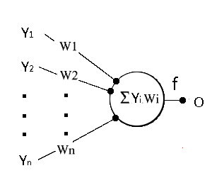
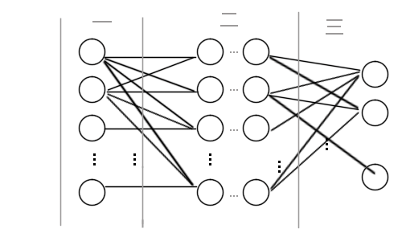

简单的讲解一下人工神经网络的结构
<!--more-->

__首先__ 讲一下什么是人工神经网络
顾名思义，人工神经网络就是人为的模拟大脑的结构  
从而让人工神经网络能够完成部分智能操作  

人工神经网络正如模拟大脑的一样  
它也由许多人工神经元组成    

现实当中人脑的神经元会根据输入信号来输出相应的信号  
由于人脑神经元的具体活动实在是太过复杂  
因此人工神经元实际上会大大简化  
最终，它的数学模型如下  
   
它有多个输入，一个输出  
每个输入都占有不同的权重    
人工神经元内部会进行非线性运算，保证人工神经网络是非线性的

此时，这个人工神经网络的数学表达式可以写为：

O = f(ΣYᵢWᵢ) 
---
其中f()为激活函数，通常为非线性运算函数 
例如sigmod函数
即对输入与对应的权重相乘的和进行非线性运算

以上就是一个神经元的基本模型
大量的人工神经元呈平面组合在一起就形成了BP神经网络(平面神经网络)

可以看到，BP神经网络的输入和输出的位数取决于输入层的神经元数量，相当于2个多维向量   
因此，再抽象一点，BP神经网络就相当于一个输入为n维的向量，输出为m维的向量的一个函数  
该函数的内部构造就是一个如同上图的网络  

而我们要做的，就是去控制这个函数，让它能完成类似人类大脑的工作  

__那么如何去控制它呢__  

假如有一个未知函数放在你面前，要你去猜这个函数的构造    
你唯一的方法就是尝试去输入一个值，看这个函数的计算结果是什么    
比如给你一个函数 g(x) ，再给你1个输入数据  
    g(0) = 0
此时你还猜不到这个函数是什么,再来一个数据
    g(PI/6) = 1/2
这时，你可能会想到g(x)=sin(x)，但还不确认，如果
    g(PI/4) = √2/2
此时，你会想到，该函数很大可能是g(x)=sin(x),但凡事都可能有例外...

如果给你无穷个数据都满足g(x)=sin(x)，那么你可以确定该函数百分百就是g(x)=sin(x)

这里把输入未知函数的数据和该函数输出相应的值联合起来称为"输入输出数据对"
***
实际上，神经网络就是这样的一个“猜谜”模型    
***
之前说了,BP神经网络就是一个抽象的向量函数   
我们要做的，就是不停的给它喂数据，让它去猜我们想要的函数
然后利用这个函数去计算我们输入的其它数据 
***
例如，给一个BP神经网络不停的喂g(x) = sin(x)这个输入输出数据对   
那么这个神经网络就可能找到了输入输出的规律  
下次你输入一个之前输入输出数据对当中没有出现的数据时，它就可能明白你的意思，输出对应的值    
***
看到这里，你可能一头雾水，既然我已经知道了g(x)=sin(x),那么我还让神经网络去猜g(x)干啥呢？    
没错，让神经网络去猜g(x)函数时，它自己就变成了g(x)函数，这个过程被称为"拟合"    
***
实际上，神经网络“拟合”的过程远比这复杂得多，别忘了，神经网络可以输入多个数据，输出多个数据  
同时可以拟合任意函数，这意味着我们可以尝试输入一个手写数字图像，给它一个期望输出，让它去猜：
“输入手写数字图像，输出对应数字”这样的一个函数，这样一想，岂不妙哉？    
***
有了“输入手写数字图像，输出对应数字”这样的一个函数，我们就可以拿它去完成人工才能完成的事    
比如识别手写账单，几张账单可能对人类没啥压力，但如果几十万张呢，机器可不会休息，而这也是人工智能的核心：
代替人类完成"人类才能完成的工作"...   

而这，仅仅是“平面”神经网络，后面还有更加强大的“立体”神经网络